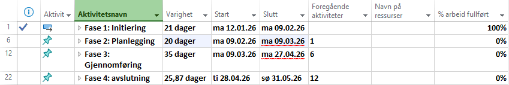
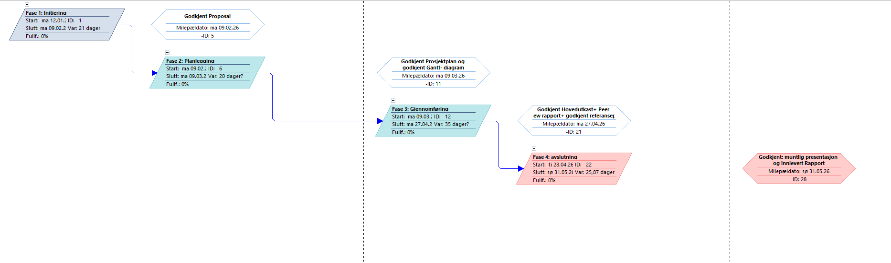
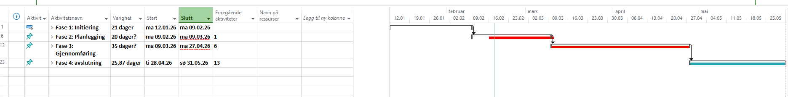
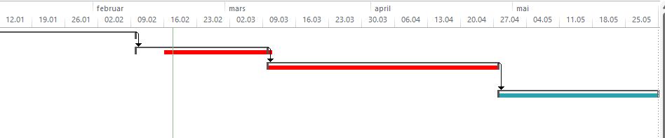
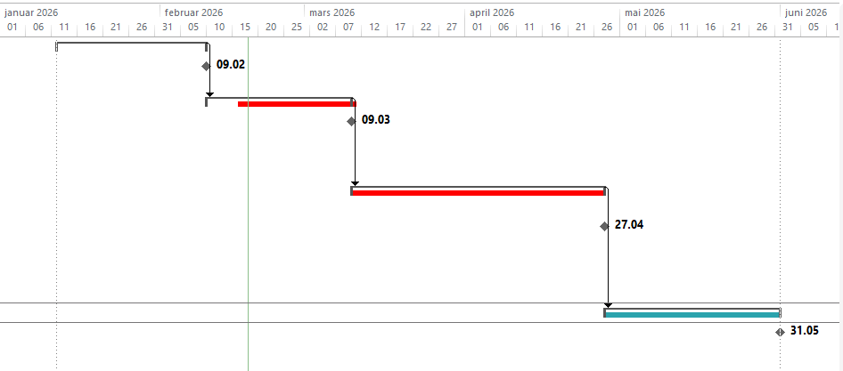

# Prosjektstyringsplan

## LOG 650 Forskningsprosjekt: Logistikk og KI

- Dato: 2026-02-17
- Utarbeidet av: Julie Bjørheim
- Prosjektleder: Julie Bjørheim
- Autorisert av: Høgskolen i Molde

> Markdown-arbeidskopi konvertert fra `Prosjekt Plan (1).rtf` 14.04.2026. Originalfilen er beholdt som referanse.

# Sammendrag

Dette dokumentet utgjør prosjektstyringsplanen for LOG650
Forskningsprosjekt: Logistikk og KI prosjektet. Det dokumenterer
planbaselines for omfang, fremdrift og risiko, og gir
tilleggsinformasjon for å støtte prosjektleder og team i vellykket
gjennomføring.

Dette er et levende dokument, og skal oppdateres av prosjektleder ved
behov gjennom prosjektets løpetid.

## Behov

Dette prosjektet svarer på følgende behov om å forbedre
beslutningsstøtten i logistikk operasjoner der usikkerhet og
operasjonell nedetid påvirker effektiviteten og lønnsomhet til
bedriftene. I offshore supply sektoren representerer offhire tid
betydelige kostnader, samtidig som tilgjengelig historiske data i liten
grad utnyttes systematisk til prediktiv analyse.

Tradisjonelle planleggings og prognosemetoder er ofte basert på
historisk gjennomsnitt og erfaringsbaserte vurderinger, noe som kan føre
til en lite optimal ressursbruk og redusert robusthet. Derfor er det et
behov for å undersøke om Kunstig intelligens og kvantitative
analysemetoder kan benyttes til å forbedre prognoser og å redusere
usikkerheten om når neste offhire kommer.

## Sponsor

Emneansvarlig/Foreleser er sponsor for dette prosjektet, ansvarlig for
prosjektog myndighet for godkjenning av denne prosjektplanen og
eventuelle endringer under gjennomføringen.

## Kunde

Kunde for dette prosjektet vil være representert av relevant ekstern
aktør innen offshore rederiene, dersom tilgang til virksomhetsdata og
samarbeid blir etablert. I fravær av ekstern samarbeidspartner vil
prosjektet gjennomføres som et rent akademisk forskningsprosjekt, der
målgruppen er beslutningstakere og fagmiljøer innen logistikk og kunstig
intelligens.

## Forskningsprosjekt

Forskningsprosjekt-analysen fra initieringen er revidert for å
reflektere resultatene fra prosjektplanleggingen. Oppsummert indikerer
analysen i planleggingsfasen at prosjektet er faglig forsvarlig og at
forventet kunnskapsverdi og læringsutbyttet overstiger ressursinnsatsen.

### Alternativer

Følgende alternativer ble vurdert: 1. Ren litteraturstudie: dette
alternativet ville innebære en systematisk analyse av eksisterende
forskning på kunstig intelligens innen logistikk uten modellering eller
en dataanalyse. Selv om dette kunne ha gitt innsikt så ville dette ikke
være egent til emne LOG650 som spesifisere en kvantitativ tilnærming og
en praktisk anvendelse av en analytisk metode.

2\. bærekraftig logistikk: dette alternativet ble også vurdert da i form
av hvor mye kan ett skip redusere hastigheten uten at det påvirker
leveransen i stor grad. Derimot så er dette et tema mange har sett på
tidligere og er tiltak som allerede er satt i bruk for å gjøre
klimatiltak innen shipping. Dermed er dette også lite relevant på grunn
av at dette allerede er i bruk og har god effekt.

3\. kvantitativ analyse med testing av KI: dette alternativet ble valgt
for dette innebærer utvikling og testing av kvantitative metoder basert
på tilgjengelige data, med mål om å evaluere hvordan KI kan bidra som
beslutningstøtte innen logistikk.

### Forutsetninger

Forskningsprosjektet er basert på følgende forutsetninger:

1.  Forutsetter tilgang på relevante datasett, enten gjennom ekstern
    samarbeidspartner eller gjennom realistisk simulerte data som
    representerer operasjonelle forhold innen offshore næringen.

2.  Prosjektet også gjennomføres innenfor tidsrammen gitt i emnet
    LOG650, og det forutsetter også at prosjektet blir jobbet med i
    denne perioden

3.  Tilgang til nødvendige analyseverktøy for eksempel, Excel, Python,
    Github etc for gjennomføring av modelleringen og statistisk analyse.

4.  Tilgang til relevant forskningslitteratur innen logistikk og kunstig
    intelligens for å sikre den teoretiske og metode valget.

### Gevinster

Gevinstene forventes å være som følger:

1.  Økt faglig innsikt i hvordan kunstig intelligens og kvantitative
    analysemetoder kan brukes for å håndtere usikkerhet og variabler.

2.  bygge kompetanse innen bruk av KI modeller og sammenligne med
    tradisjonelle metoder.

3.  For bransjen kan gevinsten være unngåelse av ekstra kostnader ved at
    fartøy holder seg i drift lengre.

4.  Bransjen kan også oppleve en økt effektivisering i bruk av flåten
    slik at man også får økt inntekter.

### Kostnader

Kostnadene i dette prosjektet består primært av tidsressurser knyttet
til planlegging, datainnsamling, analyse, modellering og
rapportskriving.

Siden prosjektet gjennomføres som en del av emnet LOG650 så vil dette
innebære ingen direkte økonomiske investeringer i form av eksterne
anskaffelser eller kapitalutgifter.

Den totale arbeidsmengden er estimert til å tilsvare emnets
studiepoengbelastning, som er 15 poeng. Det vil si at tidsbruken i uken
blir beregnet til 18,75 timer. Videre vil indirekte kostnader som bruk
av programvarer og tilgang til forskningslitteratur bli dekket gjennom
Høgskolen i Molde.

### Analyse

Sammenligningen av gevinster og kostnader viser at det valgte
alternativet har en positiv nytteverdi i forhold til ressursbruken.
Prosjektets kostnader er begrenset til tidsbruk og har gevinster som
kompetanseutvikling, økt forståelse for Kunstig Intelligens og praktisk
beslutningsstøtte i operativ sammenheng. Derfor er den forventede
verdien estimert til å overstige ressursbruken.

# Omfang

Denne seksjonen beskriver prosjektomfanget for LOG650
Forskningsprosjekt: Logistikk og KI inkludert prosjektmål,
forutsetninger, begrensninger, krav og arbeidsnedbrytningsstruktur som
definerer alle leveranser som skal produseres i prosjektgjennomføring og
avslutning. Den beskriver også prosessen som skal brukes for
omfangsverifikasjon.

All planlegging av prosjektets fremdriftsplan og risiko som beskrives i
resten av dette dokumentet, er basert på denne omfangsdefinisjonen.

Endringer i prosjektomfanget etter at denne planen er godkjent og
etablert som baseline må gå gjennom den formelle
endringskontrollprosessen beskrevet i seksjon 12 –
Endringskontrollprosess.

## Mål

Prosjektmålet er å gjennomføre en kvantitativ sammenligning mellom
tradisjonelle prognosemodeller og KI baserte metoder for å evaluere
beslutningsgrunnlaget.

Prosjektets forutsetninger er:

- Prosjektets fremdrift følger fastsatte milepæler i prosjektplanen.

- Proposal godkjennes av foreleser før gjennomføring.

- Prosjektet gjennomføres som et individuelt arbeid innenfor rammene til
  emne LOG650

- Leveransen består av en forskningsrapport som er skrevet i henhold til
  krav fra LOG650

Prosjektets begrensninger er:

- Prosjektet skal være gjennomført i løpet av vår semesteret 2026

- Prosjektet har begrenset tilgang til industrielle datasett og blir
  dermed tvunget til å basere seg på tilgjengelige eller simulerte data.

- Prosjektet vil ikke bli implementert i et operativt system.

- Prosjektet vil også bli begrenset av studentens tilgjengelige
  arbeidstid i prosjektperioden.

- Rapporten må oppfylle kravene til emnets vurderingskriterier.

## Krav

LOG 650 sine prosjektkrav gir den omfangsdetaljen som trengs for å
realisere prosjektmålet. Kravene beskriver hva prosjektet må oppfylle
for å nå målet, ikke hvordan det skal gjøres. «Hvordan» vil bli definert
under prosjektgjennomføringen etter hvert som detaljerte krav og
designleveranser utvikles.

Krav er identifisert innen områdene funksjonalitet, metode,
dokumentasjon, informasjonssikkerhet og reproduserbarhet.

1.  funksjonalitetskrav kommer av at prosjektet skal minst ha en
    tradisjonell prognosemodell, i tillegg til en KI basert
    prognosemodell,

2.  Modellene skal bli vurdert utfra objektive ytelsesmål slik som
    prediksjonsfeil, nøyaktighet etc.

3.  Det vil bli gjennomført en sammenligning mellom modellene for å
    vurdere forskjellen i prediksjonsevne.

4.  Analysen skal være reproduserbar og dokumentert slik at
    fremgangsmåten kan etterprøves.

5.  Datagrunnlaget skal beskrives og vurderes med hensyn til kvalitet og
    begrensninger

6.  Valgte modeller og metoder skal begrunnes teoretisk med relevant
    forskningslitteratur

7.  Prosjektet skal leveres inn etter standarden til emne LOG 650

8.  resultatene skal presenteres på en strukturert og transparent måte,
    inkludert tabeller, figurer etc.

9.  Prosjektet skal inneholde en kritisk drøfting av funn, metode
    begrensninger og implementeringen av KI

## Løsning

Løsningen som skal utvikles for å oppfylle prosjektmålet er en
strukturert forskningsprosess med en kvantitativ sammenligning mellom
tradisjonelle metoder og KI metoder innenfor den gitte
problemstillingen. Et overordnet diagram er gitt nedenfor.

Problemstilling

↓

Litteratursøk og teoretisk rammeverk

↓

Metodevalg og forskningsdesign

↓

Datainnsamling / simulering

↓

Dataklargjøring

↓

Tradisjonell modell KI-modell

↓ ↓

→ Modell-evaluering ←

↓

Sammenligning

↓

Analyse og drøfting

↓

Konklusjon

## Arbeidsnedbrytningsstruktur

LOG 650 sin arbeidsnedbrytningsstruktur (WBS) utgjør den formelle
baselinen for hele prosjektets omfang. Prosjektleder og
delprosjektledere gjennomførte flere planleggingsiterasjoner for å
utarbeide WBS. WBS dokumenterer alle prosjektleveranser og fanger opp
alt arbeid som skal utføres i prosjektet.

WBS er vist

Leveransene i arbeidsnedbrytningsstrukturen kan også finnes som
flytskjema over rekkefølgen de utføres i, i seksjon 3.1 –
Avhengighetsdiagram, og som planlagt over kalenderen i seksjon 3.2 –
Gantt-plan.

## Omfangsverifikasjon

Alt arbeid som leveres inn i sluttproduktet skal verifiseres både av
prosjekteamene som har produsert leveransene, og gjennom uavhengig
verifikasjon fra QA-organisasjonen, for å sikre at leveransene er i
samsvar med alle krav og er egnet for formålet – dvs. i stand til fullt
ut å dekke behovet de var ment å tilfredsstille.

Før hver leveranse ferdigstilles skal prosjekteamene først verifisere
eget arbeid for å sikre at det er feilfritt og oppfyller alle
prosjektkrav, før det sendes videre til QA for verifikasjon.
Leveranse-eierne skal ikke basere seg på QA-prosessen for å finne avvik
og feil.

Kvalitetssikring (QA) skal deretter gjennomføre formell verifikasjon for
å bekrefte at prosjektleveransene er korrekt bygget og konfigurert.
Eventuelle avvik eller mangler skal dokumenteres, og korrigerende tiltak
skal defineres av leveranse-eier. Korrigeringene skal gjennomføres så
raskt som rimelig av leveranse-eierne, og deretter re-verifiseres av QA.
En leveranse skal ikke passere verifikasjon før QA-organisasjonen
formelt bekrefter at alle avvik er håndtert og at arbeidet er klart til
å gå videre til neste steg.

Verifikasjoner kan gjennomføres gjennom inspeksjoner, demonstrasjoner,
analyser eller tester, avhengig av hva som er hensiktsmessig.
Verifikasjoner skal gjennomføres gjennom hele prosjektet etter hvert som
enkeltdeler, utkast, versjoner, inkrementer eller sprinter
ferdigstilles, for å avdekke avvik og muliggjøre korrigering lenge før
endelig leveranse etableres som baseline.

Der det er mulig skal scenario-basert verifikasjon benyttes, der
verifikasjonen gjennomføres i konteksten av et eksempel på faktisk bruk
av leveransen. Dette gir mest mulig realistisk verifikasjon av at
leveransen oppfyller kravene, og gjør det samtidig tydelig at arbeidet
er egnet for formålet. De fremtidige forretningsprosessene (to-be) som
utvikles som del av prosjektets første steg, vil være grunnlaget for
disse scenarioene der det er relevant.

Der det er relevant skal terskler for avvik og feil etableres for å
tillate at mindre avvik kan korrigeres i støtte-/driftsfasen, samtidig
som arbeidet kan gå videre til neste steg. Når denne tilnærmingen
vurderes som hensiktsmessig, skal QA samarbeide med prosjektgruppen og
kunde-/brukergrupper for å etablere kriterier etter følgende struktur:

- Det må være null kategori 1-saker – som påvirker kjernefunksjonalitet.

- Det må være færre enn N (f.eks. 3) kategori 2-saker – der det finnes
  en workaround som er akseptabel for kunderepresentanten inntil saken
  er rettet innen rimelig tid.

- Det må være færre enn M (f.eks. 5) kategori 3-saker – mindre
  brukervennlighetsavvik som ikke hindrer bruk, og som
  kunderepresentanten godtar kan håndteres i støtte/driftsfasen eller i
  neste prosjektfase.

Der tersklene over vurderes som nyttige for vurdering av leveranser,
skal de avtales og dokumenteres under testplanleggingen før
leveransetesting starter.

# Fremdrift

Denne seksjonen dokumenterer
fremdrifts-baselinen for LOG650 der prosjektarbeidet definert i
WBS mappes mot kalenderen for å fastslå prosjektets varighet og den
kritiske linjen som styrer sluttdatoen.

Planlogikken er beskrevet i seksjon 3.1 – Avhengighetsdiagram.
Avhengighetsdiagrammet, mappet mot kalenderen og med total
prosjektvarighet, er gitt i seksjon 3.2 – Gantt-plan. Den kritiske
linjen som styrer prosjektvarighet og sluttdato er gitt i seksjon 3.3 –
Kritisk linje. Viktige milepæler er dokumentert i seksjon 3.4 –
Milepæler.

Endringer i fremdriftsplanen etter at denne planen er godkjent og
etablert som baseline må gå gjennom den formelle
endringskontrollprosessen beskrevet i seksjon 12 –
Endringskontrollprosess.

## Avhengighetsdiagram

Avhengighetsdiagrammet for LOG650 dokumenterer gjennomføringslogikken
for prosjektet, ved å flytskjeme leveransene for å vise avhengigheter
mellom dem og rekkefølgen prosjektarbeidet skal utføres i.

Prosjektleder og faglederne gjennomførte flere planleggingsiterasjoner
for å etablere et komplett og korrekt avhengighetsdiagram som
dokumenterer sammenhengene mellom alt prosjektarbeid.

Dette avhengighetsdiagrammet gir den logiske strukturen for
prosjektarbeidet, som deretter mappes til kalenderen slik det fremgår av
Gantt-planen i neste seksjon.

## Gantt-plan

Delprosjektlederne utarbeidet detaljerte
aktivitetsnedbrytninger for alle sine leveranser for
å estimere
varighet for alle arbeidselementer. Strukturen fra
avhengighetsdiagrammet og disse estimatene ble deretter lagt inn i
Microsoft Project for å få en Gantt-plan som viser hvordan
prosjektarbeidet mappes mot kalenderen, inkludert beregning av kritisk
linje som styrer prosjektets sluttdato. Denne Gantt-planen utgjør den
formelle fremdrifts-baselinen for LOG650.

## Kritisk linje

Et utdrag av LOG650 Gantt-plan som viser
kun leveransene på prosjektets kritiske linje, er vist nedenfor.
Leveransene er listet i rekkefølge etter ferdigdato og viser arbeidet
som driver prosjektets varighet og sluttdato i den kalenderrekkefølgen
det er planlagt å fullføre.

Det er avgjørende å levere dette arbeidet i henhold til plan for å unngå
forsinkelser i hele prosjektet, og dette skal være et særlig fokusområde
for prosjektleder og delprosjektledere. Ressurser skal omdisponeres fra
arbeid utenfor kritisk linje til leveranser på kritisk linje der det er
praktisk mulig, dersom arbeidet på kritisk linje krever ekstra ressurser
for å opprettholde planlagt fremdrift.

## Milepæler

LOG650- prosjektets milepæler markerer hendelser der viktige
arbeidselementer fullføres og som i betydelig grad bringer prosjektet
videre.

En Gantt-plan som viser prosjektets milepæler slik de faller i
kalenderen, er vist i figuren nedenfor.

# Risiko

Denne seksjonen beskriver risikostyringsprosessen for LOG650 og gir en
kopi av risikoregisteret som baseline.

## Prosess for risikostyring

Risikoregisteret ble utarbeidet av prosjektleder og prosjektledere for
delområder, og forbedret iterativt gjennom planleggingsfasen. Risikoer
ble identifisert ved å gå gjennom alle punkter i vår standard
risikosjekkliste, ved å se på risikoplanlegging og erfaringer fra
tidligere lignende prosjekter, samt ved konsultasjon med
prosjektgruppen. Risikoene ble kvantifisert, tiltak ble utarbeidet for å
unngå eller redusere risikoene så langt som mulig, beredskapsplaner ble
utarbeidet for å håndtere hendelsen dersom risikoen likevel inntraff, og
et endelig kvantifisert risikobudsjett ble etablert som baseline.

Sannsynlighet og tidsestimater for risikoene ble utviklet av
prosjektgruppen basert på tidligere erfaring.

Eierskap til enkeltstående risikoer er lagt til det nivået som er
nærmest og best i stand til å håndtere risikoen. Risikoregisteret skal
gjennomgås ved slutten av hvert ukentlige statusmøte. Risikoutløsere
skal overvåkes av risiko-eierne, og tiltak skal iverksettes proaktivt
for å unngå eller redusere risiko der det er mulig. Risikotiltaksplaner
skal revideres og forbedres gjennom hele prosjektet ved behov. Dersom
det blir tydelig at en risiko ikke kan unngås, skal beredskapsplanene
aktiveres.

Risikotidsbufferen er planlagt i henhold til prinsippene for Critical
Chain Management, som én samlet buffer før den kritiske kundehendelsen
hvis planlagte dato skal beskyttes mest. Denne hendelsen ble
identifisert som rett før oppstart av pilotutrulling av den første
produksjonslinjen.

## Risikoregister

LOG650 sitt risikoregister, som viser kjente prosjektrisikoer, estimerte
konsekvenser for tid og kostnad, eier, utløsere, tiltak og
beredskapsplan, finnes på de følgende sidene. Det fullstendige
risikoregisteret gir også tilleggsinformasjon om
kvantifiseringsvurderingen før risikotiltaksplanleggingen ble anvendt.

|  |  |  |  |  |
|----|----|----|----|----|
| **Risiko** | **Sannsynlighet** | **Konsekvens** | **Tiltak** | **Beredskap** |
| Forsinkelse i datainnsamling | Middels | Høy | Starte datainnsamling så tidlig som mulig | Forenkle modellkompleksitet |
| Utilstrekkelig data | Middels | Høy | Se gjennom dataen nøye | Simulere eventuelt manglende data kvalitet/mengde |
| Modellene gir utydelige resultater | Middels | Middels | Teste flere modeller | Fokusere på metodisk drøfting i rapport |
| Tidsmangel i avslutningen | Lav | Høy | Ferdigstille så mye som mulig så tidlig som mulig i rapporten | Prioritere kjernekapitler |
|  |  |  |  |  |
| Utfordringer i KI implementasjon | Middels | Middels | Begrense modellkompleksiteten | Benytte enkle algoritmer |
|  |  |  |  |  |
| Begrenset tilgjengelig arbeidstid grunnet jobb ved siden av studiet | Middels | Høy | Planlegge arbeid i forkant av milepæler og starte kritiske aktiviteter tidlig | Prioritere kjerneleveranser og redusere omfang i ikke kritiske analyser |
|  |  |  |  |  |

# Saker

Nødvendige ressurser, fremdrift og budsjett for å håndtere alle
forventede prosjekt saker er bygget inn i baselineplanen, med følgende
saker fortsatt uavklart og som må løses under gjennomføringen.

Følgende saker er uavklart vedd planleggingens slutt og som vil bli
fulgt opp i gjennomføringsfasen:

1.  Endelig avklaring av datagrunnlag (reelle data vs simulert datasett)

2.  Endelig valg av spesifikke Ki modeller som skal benyttes, samt
    tradisjonelle modeller

3.  Tidsdisponering i perioder med høy arbeidsbelastning utenfor studiet

# Interessenter

Denne seksjonen beskriver de viktigste
interessentene for LOG650. Prosjektets interessenter påvirkes av
og kan påvirke prosjektet, og er derfor inkludert i definisjon av
prosjektomfang og utvikling av prosjektplanen, og vil inngå i
regelmessig kommunikasjon etter hvert som prosjektet utvikler seg. De
viktigste interessentene, med rolle, hovedbehov, prioriteringer og
planlagt kommunikasjon, er beskrevet i interessentregisteret nedenfor.

1.  Student som også er prosjektleder. Ansvarlig for hele prosjektet,
    med planlegging og gjennomføringer.

2.  Emneansvarlig/forelesere: ansvar for godkjenning av proposal,
    prosjektplan og rapport.

3.  Peer review gruppe: skal kvalitetssikre arbeidet

# Ressurser

Denne seksjonen beskriver prosjektteamet, gir en ressursbelastning over
tid, og beskriver planene for håndtering av kritiske ressurser som
kreves for å gjennomføre \[ABC\]-prosjektet.

## Prosjektteam

Prosjektteamet som skal gjennomføre LOG650- prosjektet er nevnt
nedenfor.

På grunn av den kritiske betydningen LOG650 -prosjektet har for
virksomheten, er de utpekte delprosjektlederne de mest senior og erfarne
medarbeiderne fra hver avdeling. Delprosjektlederne rapporterer direkte
til prosjektleder for gjennomføring av prosjektet, og har ansvar for å
lede alt arbeid og teammedlemmer innen sitt fagområde. Leveransene som
hver delprosjektleder er ansvarlig for, er listet i eier-kolonnen i
WBS-ordlisten (WBS-ordliste).

De ulike arbeidsteamene på operativt nivå hentes fra
matriseorganisasjonen, dvs. fra virksomhetens funksjonsavdelinger. For å
sikre at det ikke oppstår forsinkelser, skal alle teammedlemmer være
allokert på fulltid til dette prosjektet i periodene de trengs.

Roller og ansvar for prosjektsponsor, prosjektleder og delprosjektledere
er beskrevet i tabellen nedenfor.

<table>
<tbody>
<tr>
<td>
<strong>Name</strong>
</td>
<td>
<strong>Role</strong>
</td>
<td>
<strong>Responsibilities</strong>
</td>
</tr>
<tr>
<td></td>
<td></td>
<td></td>
</tr>
<tr>
<td>
Forelesere/

Emneansvarlig
</td>
<td>
Prosjektsponsor
</td>
<td>
• Godkjenning av prosjektplanen, omfang, fremdriftsplan, budsjett
og risikobudsjett.

• Godkjenning av endringer i planens baseline når prosjektet er i
gang.

• Lede de månedlige prosjektgjennomgangene.

• Sikre fortsatt støtte i virksomheten.

• Løse saker som prosjektleder ikke kan løse.
</td>
</tr>
<tr>
<td>
Julie Bjørheim
</td>
<td>
Prosjektleder
</td>
<td>
• Utarbeide en komplett, korrekt og realistisk prosjektplan.

• Lede prosjektet for å oppnå best mulig måloppnåelse mht. omfang,
fremdrift, budsjett og risiko.

• Lede delprosjektlederne.

• Sikre at prosjektresultatet er egnet for formålet og fullt ut
oppfyller interessentenes forventninger.

• Formell statusrapportering av prosjektets fremdrift én gang per
måned.

• Gjennomføre de månedlige prosjektgjennomgangene og presentere
prosjektstatus for sponsor og nøkkelinteressenter.

• Lede det ukentlige saksstatusmøtet.
</td>
</tr>
<tr>
<td>
[Lead]
</td>
<td></td>
<td></td>
</tr>
<tr>
<td>
[Lead]
</td>
<td></td>
<td></td>
</tr>
<tr>
<td>
[Lead]
</td>
<td></td>
<td></td>
</tr>
<tr>
<td></td>
<td></td>
<td></td>
</tr>
</tbody>
</table>

## Ressursbelastning

Prosjektets ressursbelastning består primært av studentens tilgjengelige
arbeidstid gjennom prosjektperioden. Arbeidsinnsatsen er fordelt i
henhold til prosjektets faseinndeling.

Siden prosjektet gjennomføres parallelt med 100% arbeid, er effektiv
planlegging og prioritering av aktiviteter på kritisk linje avgjørende.

## Kritiske ressurser

Følgende ressurser er vurdert som kritiske for suksess i
LOG650-prosjektet:

1.  Studentens tilgjengelige arbeidstid

2.  Tilgang til analyseverktøy (Ms project, Ki verktøy, Python etc)

3.  Tilgang til relevant og tilstrekkelige data

4.  Tilstrekkelig faglig veiledning ved behov

# Kommunikasjon

Denne seksjonen beskriver planlagt formell kommunikasjon etter hvert som
LOG650 prosjektet gjennomføres.

Formell prosjektkommunikasjon skal bestå av ukentlige statusmøter og
eventuell veiledning med forelesere. De følgende seksjonene gir mer
informasjon.

## Ukentlige saksstatusmøter

Formålet med det ukentlige saksstatusmøtet er å gi et fast
kommunikasjonspunkt for kjerneteamet, der man diskuterer prosjektets
saker og risikoer, koordinerer videre tiltak ved behov, og opprettholder
fremdrift og momentum i prosjektet.

Prosjektleder skal lede møtet. Møtet skal holdes hver mandag morgen kl.
09:00. Varighet skal være maks én time.

Faglederne skal gjennomgå risikoene på prosjektets saksliste for tiltak,
oppdatering eller lukking ved behov. Nye saker skal registreres, og
mulige løsninger diskuteres så langt tiden tillater. Prosjektkoordinator
skal distribuere oppdatert liste til alle delprosjektledere ved
avslutning av møtet. En kopi av malen for saksliste finnes i vedlegg C.

Ved slutten av hvert møte skal teamet også gjennomgå prosjektets
risikoregister, gjøre nødvendige oppdateringer og koordinere videre
tiltak ved behov.

## Veiledning med forelesere 

Prosjektet inkluderer også mulighet for faglig veiledning med
emneansvarlig og forelesere ved behov. Veiledningen benyttes primært
til\_ avklaring av metodiske valg, diskusjon av modelltilnærming,
avklaring av forventninger til leveranse og avklaring av eventuelle
endringer i omfang.

Veiledning gjennomføres på forespørsel og dokumenteres ved behov i
prosjektets arbeidsnotater. Kritiske avklaringer som påvirker omfang
eller fremdrift vurderes opp mot prosjektets etablerte referanseplan.

# Kvalitet

Denne seksjonen beskriver tilnærmingen til kvalitetsstyring gjennom hele
LOG650- prosjektet.

Kvaliteten på prosjektets leveranser er avgjørende for suksess, og vil
være et hovedfokus for ledelsen og prosjektteamet gjennom hele
gjennomføringen.

De fire kvalitetsprinsippene som ligger til grunn for dette prosjektet
er oppsummert nedenfor:

1.  Planlegging. «Kvalitet må planlegges inn, ikke inspiseres inn».
    Selv om alt prosjektarbeid skal inspiseres og testes ved
    ferdigstillelse, skal kvalitet bygges inn i arbeidet av teamene mens
    det utføres.

2.  Gevinst. Kvalitetsmessig gode deler og prosesser reduserer samlet
    kostnad og tidsbruk, fordi de øker effektiviteten, reduserer behovet
    for testing, reduserer akseptanse- og sertifiseringsutfordringer, og
    reduserer uforutsette problemer når løsningen er i drift.

3.  Kontinuerlig forbedring. The team will gather lessons learned
    throughout the prosjekt to continuously build on incremental
    improvement as the work progresses.

4.  Egnet for formålet. Alle prosjektleveranser må være «egnet for
    formålet», dvs. faktisk kunne utføre jobben de er ment for og fullt
    ut tilfredsstille kundens behov. Dette kravet skal også inngå i de
    formelle vilkårene (Terms and Conditions) i alle
    leverandørkontrakter.

Alle prosjektmedlemmer skal bruke beste praksis og standarder innen sitt
fag i gjennomføring av arbeidet. I tillegg er fagfellevurderinger og
brukerreviews bygget inn i leveransearbeidet som viktige bidrag for å
maksimere kvaliteten på resultatet. Mer informasjon om bruk av
fagfellevurderinger og brukerreviews finnes i de følgende seksjonene.

## Fagfellevurderinger

Fagfellevurderinger er en av de mest effektive prosessene for å sikre at
leveranser har høy kvalitet og er fullt ut egnet for formålet.

Det er to typer fagfellevurderinger som skal brukes i dette prosjektet:
uformelle fagfellevurderinger som brukes for alle prosjektleveranser, og
formelle fagfellevurderinger som kreves for leveranser med helse-,
sikkerhets- eller juridisk sensitivitet. Mer informasjon følger
nedenfor.

### Uformelle fagfellevurderinger. 

Uformelle fagfellevurderinger har ikke den administrative overheaden som
formelle fagfellevurderinger krever, men gir likevel viktig
kvalitetssikring av arbeidet. Prosessen for uformelle
fagfellevurderinger er oppsummert nedenfor:

1.  Eier av hver leveranse som overleveres til andre i prosjektet skal
    sikre at leveransen har vært gjennom en fagfellevurdering før den
    ferdigstilles.

2.  For store arbeidspakker skal det gjennomføres flere
    fagfellevurderinger gjennom utviklingsprosessen av leveransen, slik
    at hver enkelt review krever håndterlig innsats. Som
    tommelfingerregel bør hver review kreve høyst én time per reviewer.

3.  En fagfellevurdering bør inkludere to eller tre fagfeller for å gi
    en helhetlig vurdering fra mer enn ett perspektiv.

4.  Der det er mulig skal leveranse-eier holde ett konsolideringsmøte
    med alle fagfellene for å samle et konsolidert sett med kommentarer
    og for å legge til rette for at fagfellene kan kommentere på
    hverandres anbefalinger.

5.  Leveranse-eier kan stille oppfølgingsspørsmål for å avklare en
    kommentar, men skal avstå fra å diskutere/argumentere mot
    nøyaktigheten i kommentaren slik at konsolideringsmøtet forblir
    fokusert på å samle inn et komplett sett med kommentarer. For å
    sikre fokus på denne sentrale egenskapen ved uformelle
    fagfellevurderinger, skal leveranse-eier si «Takk» etter mottak av
    hver kommentar.

6.  Eier av leveransen kan deretter innarbeide kommentaren i en revisjon
    av leveransen, eller forkaste kommentaren etter eget faglig skjønn.

7.  Det kreves ingen formelle protokoller for uformelle
    fagfellevurderinger, men leveranse-eier må beholde en oversikt over
    fagfellenes kommentarer i egne arkiver til prosjektet er levert, i
    tilfelle dokumentasjonen senere skulle bli etterspurt.

### Formelle fagfellevurderinger

Formelle fagfellevurderinger er påkrevd for alle leveranser som har
helse-, sikkerhets- eller juridiske krav, for å sikre at alle avvik blir
løst før ferdigstillelse. Prosessen for formelle fagfellevurderinger er
oppsummert nedenfor:

1.  QA-organisasjonen skal sikre at hver leveranse med helse-,
    sikkerhets- eller juridiske krav har gjennomført en formell
    fagfellevurdering før den ferdigstilles. En QA-representant skal
    administrere hver formelle fagfellevurderingsprosess.

<!-- -->

1.  For store arbeidspakker skal det gjennomføres flere formelle
    fagfellevurderinger gjennom utviklingsprosessen av leveransen, slik
    at hver enkelt review krever håndterlig innsats fra hver reviewer.

2.  En formell fagfellevurdering bør omfatte tre til fem fagfeller for å
    gi en helhetlig vurdering fra mer enn ett perspektiv. Fagfellene bør
    så langt som mulig velges utenfor prosjektteamet for å sikre en full
    og upartisk vurdering.

3.  Kvalitetssikring (QA) skal innkalle til og lede ett
    konsolideringsmøte med alle fagfellene for å samle et konsolidert
    sett av avvik/punkter og for å legge til rette for kommentarer på
    hverandres anbefalinger. Det er ingen fast varighet for et slikt
    konsolideringsmøte ved formell fagfellevurdering. QA-representanten
    skal registrere og følge opp den konsoliderte listen fra kommentar
    til løsning.

4.  Leveranse-eier kan stille oppfølgingsspørsmål til en fagfelle for å
    avklare avvik, og kan gi tilleggsinformasjon dersom vedkommende
    mener at et punkt ikke er korrekt. Ved uenighet mellom
    leveranse-eier eller fagfeller om riktigheten av et punkt, skal
    QA-representanten be om avstemning blant fagfellene (uten
    leveranse-eier), der QA-representanten avgjør ved stemmelikhet.
    Stemmegivningen til hvert medlem i omstridte saker, uavhengig av om
    saken får flertall, skal registreres i avviksloggen for eventuell
    senere oppfølging. QA-representanten kan etter eget skjønn
    registrere et punkt for oppfølging dersom det vurderes som
    berettiget, selv om det ikke fikk flertall.

5.  Hvert punkt som er avtalt, vedtatt ved flertall, eller tatt inn
    etter QA-representantens skjønn, skal deretter vurderes av
    leveranse-eier og håndteres på en hensiktsmessig måte enten ved
    revisjon av leveransen eller ved å gi relevant tilleggsinformasjon
    som ikke var tilgjengelig under konsolideringsmøtet. Hver
    løsning/tilbakemelding skal gjennomgås av de opprinnelige fagfellene
    for godkjenning. QA-representanten vil normalt følge den
    opprinnelige fagfellens vurdering av om løsningen er tilstrekkelig.
    Dersom enighet ikke oppnås, kan QA-representanten likevel godkjenne
    et punkt som løst dersom dette vurderes som hensiktsmessig,
    forutsatt at beslutningen godkjennes av QA-direktøren.

6.  Formelle protokoller fra alle fagfellevurderinger og tilhørende
    løsnings-/korrigeringshandlinger skal arkiveres i QA-arkivet i minst
    fem år etter at prosjektet er avsluttet.

# Endringskontrollprosess

Denne seksjonen beskriver prosessen som skal brukes for å sikre at alle
foreslåtte endringer i LOG 650- prosjektet håndteres kontrollert og med
hensyn til alle konsekvenser av en potensiell endring.

Når denne prosjektplanen er godkjent av sponsor, skal alle endringer i
omfang, fremdriftsplan, budsjett eller risikobudsjett gå gjennom den
formelle endringskontrollprosessen beskrevet i seksjon 12 –
Endringskontrollprosess.

I tillegg må enhver endring i en leveranse, etter at den er baselinet og
godkjent under prosjektgjennomføring (for eksempel design og
dokumentasjon), også gå gjennom den formelle endringskontrollprosessen,
for å sikre at alle konsekvenser identifiseres og at alle berørte parter
inkluderes i analysen og kommunikasjonen.

En oppsummering av endringskontrollprosessen er gitt nedenfor:

1.  Først må endringen dokumenteres formelt i et
    endringsforespørselsskjema, hvor en kopi er gitt i vedlegg F for
    enkelhets skyld.

2.  Dersom endringen er akutt nødvendig på grunn av umiddelbar risiko
    for prosjektets suksess eller umiddelbar påvirkning på helse,
    sikkerhet, sikring eller juridisk etterlevelse, kan prosjektleder
    autorisere endringen umiddelbart og deretter følge opp med en full
    konsekvensanalyse og kommunikasjon med sponsor, kunde og andre
    relevante parter så snart det er praktisk mulig.

3.  Ellers skal det innkalles til et møte i endringskontrollstyret (CCB)
    for å evaluere endringen med bred deltakelse fra alle parter som kan
    være berørt, inkludert representanter fra alle prosjektets kjerne-
    og støttefunksjoner. Hovedformålet med dette første møtet er
    utelukkende å identifisere alle mulige påvirkningsområder.
    Prosjektleder skal lede møtet.

4.  En person som er nærmest endringen skal deretter utpekes til å følge
    opp etter første møte for å fullføre en analyse og fastslå den
    samlede effekten av endringen på omfang, fremdriftsplan, budsjett,
    risiko, anskaffelser og andre berørte prosjektelementer. Muligheter
    og alternativer for å håndtere endringen skal vurderes. Oppdatert
    krav-baseline, arbeidsnedbrytningsstruktur (WBS),
    avhengighetsdiagram (precedence diagram), estimater, Gantt-plan og
    risikoregister skal utarbeides for endringen og eventuelle
    alternativer ved behov.

5.  Endringskontrollstyret skal deretter samles på nytt for å vurdere
    konsekvensene av endringen og velge beste alternativ dersom mer enn
    én løsning er mulig.

6.  Dersom endringskontrollstyret vurderer endringen som nødvendig eller
    på annen måte nyttig, og den ikke påvirker baselinet omfang,
    fremdriftsplan, budsjett eller risikobudsjett godkjent av sponsor,
    kan prosjektleder autorisere endringen.

7.  Dersom endringen påvirker baselined omfang, fremdriftsplan, budsjett
    eller risikobudsjett som er godkjent av sponsor, skal
    endringskontrollstyret, etter godkjenning fra prosjektleder,
    utarbeide en anbefaling og sende den til sponsor for vurdering.
    Endringen skal ikke igangsettes før formell skriftlig godkjenning
    fra sponsor foreligger.

8.  Når en endring i omfang medfører økning i baselinet fremdriftsplan
    og budsjett, skal det alltid vurderes alternativer for å fjerne
    kompenserende omfang for å minimere konsekvensene, og disse
    alternativene skal presenteres for sponsor og kunde der det er
    relevant.

9.  Når det er fattet en beslutning om endringen, skal begrunnelsen for
    beslutningen og all relevant dokumentasjon lagres i endringsloggens
    (Change Control Log) arkiv. Hvis endringen godkjennes, skal all
    nødvendig prosjektdokumentasjon oppdateres, og alle relevante parter
    skal informeres i tide.

######### Vedlegg C - Format for prosjektets saksliste

For enkel referanse gir dette vedlegget en kopi av formatet for
Prosjektets saksliste (Saker List) som brukes til koordinering av det
ukentlige saksstatusmøtet beskrevet i seksjon 9.1 – Ukentlige
saksstatusmøter. Sakslisten skal spore sakens navn, status, ansvarlig og
forventet dato for løsning for hver sak. Dette Microsoft
Word-tabellformatet kan enkelt sorteres med kommandoen Layout / Sort
etter at nye punkter er lagt til eller oppdatert, slik at sakene kan
settes i ønsket rekkefølge etter Ansvarlig / Frist eller Frist /
Ansvarlig.

-----

**Prosjekt ABC - Saksliste**

|           |            |          |         |
|-----------|------------|----------|---------|
| **Issue** | **Status** | **Lead** | **Due** |
|           |            |          |         |
|           |            |          |         |
|           |            |          |         |
|           |            |          |         |
|           |            |          |         |
|           |            |          |         |
|           |            |          |         |
|           |            |          |         |
|           |            |          |         |
|           |            |          |         |
|           |            |          |         |
|           |            |          |         |
|           |            |          |         |
|           |            |          |         |

Bruk:

*\* Legg til rader for nye elementer etter behov, og samle deretter
sammen etter Lead eller Forfallsdato med menyelementet Tabell / Sorter.*

*\* Skriv inn datoer i formatet ÅÅÅÅ-MM-DD slik at Layout /
Sorter-kommandoen fungerer konsekvent.*

######### Vedlegg F - Skjema for endringsforespørsel

For enkel referanse gir dette vedlegget en kopi av det formelle skjemaet
for endringsforespørsel som brukes i prosessen oppsummert i seksjon 12 –
Endringskontrollprosess.

-----

**Endringsforespørsel**

**Instruksjoner: Dette skjemaet skal fylles ut
for enhver forespurt endring i et baselinet og godkjent prosjektelement,
inkludert omfang, fremdriftsplan, budsjett, risikobudsjett eller
prosjektleveranser, uansett hvor liten endringen er, og sendes via
prosjektleder for korrekt vurdering av
alle konsekvenser og
nødvendig
kommunikasjon med alle
berørte
parter.**

|                                |     |
|--------------------------------|-----|
| Prosjekt:                      |     |
|                                |     |
| Forespørsel fra:               |     |
| Dato for forespørsel:          |     |
|                                |     |
| Ønsket endring:                |     |
|                                |     |
| Begrunnelse / gevinst:         |     |
|                                |     |
| Kjente leveranser påvirket:    |     |
|                                |     |
| Kjente krav påvirket:          |     |
| Kjente kontrakter påvirket:    |     |
| Kjente fremdrift-påvirkninger: |     |
| Kjente kostnadspåvirkninger:   |     |
|                                |     |
| Andre kommentarer:             |     |
|                                |     |
